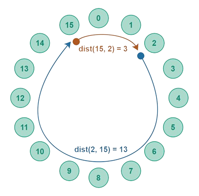

# Data-Privacy-and-Security-Project

## Authors

- André Reis - fc58192
- Daniel Nunes - fc58257
- Gonçalo Pinto - fc58178

## Project overview

### Network structure - `Chord`



De modo a criar um sistema peer-to-peer o mais descentralizado possível e ao mesmo tempo eficiente, foi decidido implementar um sistema Chord permitindo que a busca de dados tenha complexidade $O(\log N)$, onde $N$ é o número de nós. Esta eficácia deve-se ao uso de `Finger Tables` em cada nó de modo a ser possível cortar caminho durante a procura de um nó.

### Internal conection structure - `SSL/TLS`

A ligação entre os nodes é feita através de uma conexão SSL/TLS, garantindo uma comunicação segura. Cada utilizador cria uma ligação com os nodes presentes na sua Finger Table e armazena-as num hashmap para reutilizá-las, evitando a criação de uma nova ligação cada vez que necessitar de enviar uma menssagem.

Antes da ligação segura ser estabelecida, criamos uma conexão sem requisitos de segurança para gerar uma chave de sessão e assim partilhar o certificado de ambos os nodes.

### Encryption and Decryption - `AES` & `RSA`

Uma vez que as mensagens passam por nós dentro da rede antes de chegarem ao recetor, é necessário encriptá-las, pois o uso de SSL/TLS não é suficiente.

Para obter uma encriptação "end-to-end", decidimos enviar a mensagem encriptada com uma chave de sessão, acompanhada do hash dela assinado com a chave privada do transmissor. Dessa forma, obtemos confidencialidade, uma vez que a mensagem é cifrada; autenticidade, pela assinatura do transmissor; e integridade, garantida pelo hash da mensagem.

## Project Requirements

Para este projeto, o grupo decidiu utilizar a linguagem `Java`. Isto implica ter uma instalação do mesmo para conseguir executar o projeto.

Além disso, com base na nossa implementação do sistema Chord, o primeiro utilizador a entrar na rede é denominado como o `default node` e necessita de ter como IP, porta e nome: localhost, 8080 e "Wang", respetivamente. Este requirimento deve-se ao facto de facilitar o encontro com um node presente na network quando um novo se liga. Se este se desconectar a rede permanece funcional mas mais nenhum user se vai poder juntar.

## Project Limitations

Uma vez que o professor indicou que os testes seriam realizados no mesmo computador, foi decidido usar "localhost" como IP predefinido.

## How to run the project

#### Complilar 
```
mvn clean package
```
#### Correr 
```
java -jar .\target\ZapDistribuido-1.0-SNAPSHOT.jar
```